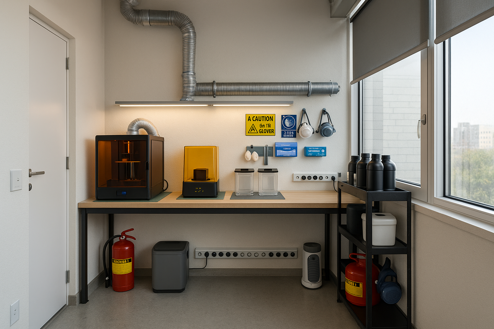

# 3d-print-room

## Розташування (зверху вниз)

* Стіл на довгій стіні навпроти вікна: глибина 4 м × 0,6 м, суцільна робоча поверхня.
* Вузьке місце для зберігання з боку вікна: полиці/шафи глибиною 4 м × 0,3 м.
* Прохід між ними: ~1,1 м вільного простору.
* Зони на столі (ліворуч → праворуч)
  * Корпус принтера (0,8 м): герметична коробка/ковпак, що відкривається спереду, з швидкознімним каналом.
  * Миття та полімеризація (0,7 м): дві криті ємності (брудний/чистий IPA або вода), станція полімеризації.
  * Оздоблення / підготовка (решта столу): обрізка, опори, упаковка.

## Вентиляція та керування освітленням

* Негативний тиск: 100-мм вбудований канальний вентилятор від корпусу принтера назовні (через віконну вентиляційну панель) з вугільним + частинковим попереднім фільтром. Герметизуйте витоки (піна/прокладка).
* Вікна: додайте плівку, що блокує ультрафіолетове випромінювання, та ролик затемнення, щоб запобігти затвердінню смоли та зменшити нагрівання.
* Тримайте двері зачиненими під час друку; відкрийте вікно біля витяжного отвору, щоб забезпечити надходження повітря.

## Електроживлення та навколишнє середовище

* Розетки: ~8 вздовж столу (GFCI/RCD): принтер, мийка, затвердіння, вбудований вентилятор, осушувач повітря, обігрівач, робочі лампи, запасний.
* Температура: підтримуйте 20–25 °C; додайте невеликий термостат-обігрівач на зиму та тихий вентилятор на літній період.
* Вологість: компактний осушувач повітря (для смоли та електроніки бажано ~40–60% відносної вологості).
* Освітлення: робочі лампи з високим CRI 4000 K над столом; Уникайте використання ламп з інтенсивним ультрафіолетовим випромінюванням поблизу смоли.

## Поверхні, безпека та робочий процес

* Робоча поверхня: хімічно стійка (ламінат або епоксидна смола); нержавіючий лоток під принтером; силіконові килимки для зон крапель.
* Комплект для захисту від розливів: паперові рушники, скребок, одноразові вкладиші, пакети на блискавці.
* ЗІЗ: нітрилові рукавички, захисні окуляри, респіратор (A1 або еквівалентний картридж з органічними парами).
* IPA / розчинники: зберігати в металевій захисній банці або закритій шафі з боку вікна (прохолодному, темному).
* Відходи: спеціальний герметичний контейнер для предметів, забруднених смолою; повністю затвердіти ультрафіолетовим випромінюванням перед утилізацією згідно з місцевими правилами.
* Пожежа: невеликий вогнегасник класу B / CO₂ поблизу входу.

## Рекомендована відомість матеріалів

| # | Позиція | К-ть | Ціна за шт., ₴ | Підсумок, ₴ | Посилання |
|---|---|---:|---:|---:|---|
| 1 | Фотополімерний 3D-принтер (Elegoo Mars 4 9K / аналог) | 1 | 12833 | 12833 | https://rozetka.com.ua/ua/3d-ustroystva-i-aksessuari/c4672483/producer=elegoo/ |
| 2 | Мийка + УФ-сушка (Anycubic Wash & Cure 3 / аналог) | 1 | 8546 | 8546 | https://rozetka.com.ua/ua/search/?text=Anycubic%20Wash%20%26%20Cure%203 |
| 3 | Смола фотополімерна 1 кг (нейтральна/сіра) | 2 | 1200 | 2400 | https://rozetka.com.ua/ua/355724820/p355724820/ |
| 4 | Ізопропіловий спирт 99.9% (каністра 5 л) | 1 | 900 | 900 | https://rozetka.com.ua/ua/328912210/p328912210/ |
| 5 | Рукавички нітрилові, 100 шт (L/XL) | 2 | 300 | 600 | https://apteka.rozetka.com.ua/ua/458615314/p458615314/ |
| 6 | Окуляри захисні прозорі | 1 | 120 | 120 | https://rozetka.com.ua/ua/search/?text=%D0%9E%D0%BA%D1%83%D0%BB%D1%8F%D1%80%D0%B8%20%D0%B7%D0%B0%D1%85%D0%B8%D1%81%D0%BD%D1%96%20%D0%BF%D1%80%D0%BE%D0%B7%D0%BE%D1%80%D1%96 |
| 7 | Респіратор 3M 6200 (півмаска) | 1 | 1200 | 1200 | https://rozetka.com.ua/ua/search/?text=%D0%A0%D0%B5%D1%81%D0%BF%D1%96%D1%80%D0%B0%D1%82%D0%BE%D1%80%203M%206200&section_id=2798842&redirected=1 |
| 8 | Картриджі 3M 6051 A1 (органічні пари), пара | 1 | 800 | 800 | https://rozetka.com.ua/ua/search/?text=%D0%9A%D0%B0%D1%80%D1%82%D1%80%D0%B8%D0%B4%D0%B6%D1%96%203M%206051%20A1 |
| 9 | Силіконовий килимок для смоли (≈40×30 см) | 2 | 200 | 400 | https://rozetka.com.ua/ua/search/?text=%D0%A1%D0%B8%D0%BB%D1%96%D0%BA%D0%BE%D0%BD%D0%BE%D0%B2%D0%B8%D0%B9%20%D0%BA%D0%B8%D0%BB%D0%B8%D0%BC%D0%BE%D0%BA%20%D0%B4%D0%BB%D1%8F%20%D1%81%D0%BC%D0%BE%D0%BB%D0%B8 |
| 10 | Мірний стакан 500 мл (PP) | 2 | 79 | 158 | https://rozetka.com.ua/ua/325250512/p325250512/ |
| 11 | Лоток нержавіючий GN 1/1 (≈530×325 мм) | 1 | 620 | 620 | https://rozetka.com.ua/ua/362274603/p362274603/ |
| 12 | Осушувач повітря ~10 л/добу | 1 | 6000 | 6000 | https://rozetka.com.ua/ua/389043636/p389043636/ |
| 13 | Електроконвектор 1.5 кВт з термостатом | 1 | 2400 | 2400 | https://bt.rozetka.com.ua/ua/259628876/p259628876/ |
| 14 | Вогнегасник CO₂ ВВК-2 (2 кг) | 1 | 1350 | 1350 | https://epicentrk.ua/ua/shop/vohnehasnyk-vuhlekyslotnyi-poputchik-vvk-2-ou-3.html |
| 15 | Канальний вентилятор 100 мм (Domovent VK 100 / аналог) | 1 | 2562 | 2562 | https://build.rozetka.com.ua/ua/vytyajnye-ventilyatory/c3730584/99355=539564/ |
| 16 | Повітропровід алюмінієвий гофр. Ø100, 3 м | 1 | 239 | 239 | https://epicentrk.ua/ua/shop/vozdukhovod-2095-alyuvent-n-100-3.html |
| 17 | Решітка вентиляційна з фланцем Ø100 мм | 1 | 166 | 166 | https://epicentrk.ua/ua/shop/mplc-resitka-ventilacijna-dospel-d-14-ow-z-flancem-100-mm-1f06d37e-9d70-6c32-8957-d95b32b8a0f8.html |
| 18 | Стільниця 3000×600 мм (робоча поверхня) | 1 | 2979 | 2979 | https://epicentrk.ua/ua/shop/stoleshnitsy-dlya-kukhni/ |
| 19 | Опори/ніжки металеві 710 мм (T‑образні) | 6 | 399 | 2394 | https://epicentrk.ua/ua/search/?q=%D0%9E%D0%BF%D0%BE%D1%80%D0%B8%2F%D0%BD%D1%96%D0%B6%D0%BA%D0%B8%20%D0%BC%D0%B5%D1%82%D0%B0%D0%BB%D0%B5%D0%B2%D1%96%20710%20%D0%BC%D0%BC |
| 20 | Стелаж металевий 180×90×40 см | 2 | 1999 | 3998 | https://epicentrk.ua/ua/shop/stellazhi-dlya-khraneniya/fs/material-karkasa-metall/ |
| 21 | Подовжувач із захистом/автоматом (8 гнізд) | 1 | 900 | 900 | https://epicentrk.ua/ua/shop/udliniteli-i-razvetviteli/ |
| 22 | Плівка на вікна з УФ‑захистом (0.61×3 м) | 3 | 374 | 1122 | https://epicentrk.ua/ua/shop/plivka-samokleika-na-vikno-z-uf-zakhystom-0-61x3-m.html |
| 23 | Рулонна штора blackout ~200×200 см | 1 | 1500 | 1500 | https://rozetka.com.ua/ua/search/?text=%D0%A0%D1%83%D0%BB%D0%BE%D0%BD%D0%BD%D0%B0%20%D1%88%D1%82%D0%BE%D1%80%D0%B0%20blackout&section_id=4627673&redirected=1 |
| 24 | Закритий бак/відро для відходів 30 л (кришка/педаль) | 2 | 900 | 1800 | https://epicentrk.ua/ua/shop/mplc-vidro-dla-smitta-mvm-bin-01-z-kriskou-ta-pedallu-30-l-antracit-bin-01-30l-anthracite-1ee94475-9dd6-65f6-95fb-b79da706b083.html |
| 25 | Металева каністра 5 л (для відпрацьованого IPA/смоли) | 1 | 600 | 600 | https://rozetka.com.ua/ua/393762732/p393762732/ |

**Разом орієнтовно: ₴56 587**
